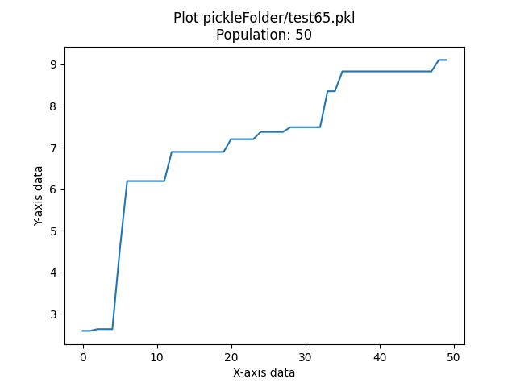

# Evolving Walker

This project was created so that I could make a robot that would be able to walk/crawl effectivly as well as being able to evolve physically as it kept on improving. 

Building a robot

# Cubes Class

To build the Robot I created a new class called Cubes. This was both inspired by Carl Simins designs where I loved the way that his robots looked and I also felt like that if I made the designs cubes it would make the math and creation of the robots easier allowing me to spend more time on the interesting parts of the project. 

The Cubes class would have a self.weights to control and create the brain. It would have a tree of parents which would keep the ordering of which cubes had which parents. It would contain a list of everysingle cube its height, length, width, as well as the data concering if each cube was a sensor or a not. This was all put in a class called Cube. Cubes was a a collection of Cube. The Cubes class could create a robot create the body and the brain. 

# Video 
https://www.youtube.com/watch?v=PM8tpkzQx4k&feature=youtu.be

# Gif 

## Authors

- [@octokatherine](https://www.github.com/octokatherine)

## Number of Simulations Run

The total number of simulations conducted exceeded 50,000 by running the program on my computer overnight. However, upon examining the fitness curves, it was observed that fitness plateaus would frequently occur at approximately 200-300 generations, beyond which only minor improvements in robot performance were observed. Consequently, in order to obtain a greater number of low-generation robots, fewer generations were run but with a larger population size.

An additional issue encountered during the simulation process was that small parameter adjustments made to the starting conditions resulted in improvements to the evolution and final fitness scores of the robot. As a result, some earlier robots were initiated with different numbers of generations compared to the subsequent robots. Changes made to the robots include adjustments to the selection method for the next generation, the number of links in the initial robot, and the frequency of different mutations occurring, such as evolving the brain at a higher rate than the body. These differences in starting conditions may have contributed to some of the differences observed in the appearance of the robots.

Despite these differences, the project aimed to investigate the evolution process and learn more about it by incorporating various changes. The following is a comprehensive list of simulations conducted, including the number of generations run, population, total simulations run highest fitness achieved, and the corresponding pickle file location.

Path: pickleFolder/test69.pkl
Generations Trained: 200
Population: 10
Total Simulations: 2000
Best Fitness of Model: 19.301054933851532

Path: pickleFolder/test68.pkl
Generations Trained: 200
Population: 10
Total Simulations: 2000
Best Fitness of Model: 7.371755589279394

Path: pickleFolder/test67.pkl
Generations Trained: 200
Population: 10
Total Simulations: 2000
Best Fitness of Model: 11.374880990639998

Path: pickleFolder/test66.pkl
Generations Trained: 200
Population: 10
Total Simulations: 2000
Best Fitness of Model: 6.969525415513104

Path: pickleFolder/test65.pkl
Generations Trained: 50
Population: 50
Total Simulations: 2500
Best Fitness of Model: 9.105079390305512

Path: pickleFolder/test64.pkl
Generations Trained: 50
Population: 50
Total Simulations: 2500
Best Fitness of Model: 11.580110052813495

Path: pickleFolder/test63.pkl
Generations Trained: 50
Population: 10
Total Simulations: 500
Best Fitness of Model: 3.9260061237295454

Path: pickleFolder/test62.pkl
Generations Trained: 500
Population: 10
Total Simulations: 5000
Best Fitness of Model: 11.466548383868778

Path: pickleFolder/test61.pkl
Generations Trained: 500
Population: 10
Total Simulations: 5000
Best Fitness of Model: 12.949485588748605

Path: pickleFolder/test60.pkl
Generations Trained: 500
Population: 10
Total Simulations: 5000
Best Fitness of Model: 10.504130684149974

Path: pickleFolder/test59.pkl
Generations Trained: 200
Population: 25
Total Simulations: 5000
Best Fitness of Model: 25.99498191365418

Path: pickleFolder/test58.pkl
Generations Trained: 200
Population: 25
Total Simulations: 5000
Best Fitness of Model: 17.015708174629516

Path: pickleFolder/test57.pkl
Generations Trained: 100
Population: 10
Total Simulations: 1000
Best Fitness of Model: 5.803501041868914

Path: pickleFolder/test56.pkl
Generations Trained: 100
Population: 10
Total Simulations: 1000
Best Fitness of Model: 5.4811631830241385

Path: pickleFolder/test55.pkl
Generations Trained: 100
Population: 10
Total Simulations: 1000
Best Fitness of Model: 13.59828398706952

Path: pickleFolder/test54.pkl
Generations Trained: 100
Population: 10
Total Simulations: 1000
Best Fitness of Model: 7.282209728287096

Path: pickleFolder/test53.pkl
Generations Trained: 100
Population: 10
Total Simulations: 1000
Best Fitness of Model: 5.601628893405993

Path: pickleFolder/test52.pkl
Generations Trained: 100
Population: 10
Total Simulations: 1000
Best Fitness of Model: 6.094847085421369

Path: pickleFolder/test51.pkl
Generations Trained: 100
Population: 10
Total Simulations: 1000
Best Fitness of Model: 7.134761360379178

Path: pickleFolder/test50.pkl
Generations Trained: 100
Population: 10
Total Simulations: 1000
Best Fitness of Model: 8.549638168845032

Path: pickleFolder/test49.pkl
Generations Trained: 100
Population: 10
Total Simulations: 1000
Best Fitness of Model: 8.385577491287986

Path: pickleFolder/test48.pkl
Generations Trained: 500
Population: 10
Total Simulations: 5000
Best Fitness of Model: 17.500675259816738

Path: pickleFolder/test47.pkl
Generations Trained: 500
Population: 10
Total Simulations: 5000
Best Fitness of Model: 7.957729572482561

Path: pickleFolder/test46.pkl
Generations Trained: 100
Population: 10
Total Simulations: 1000
Best Fitness of Model: 18.85316928507671

Path: pickleFolder/test45.pkl
Generations Trained: 500
Population: 10
Total Simulations: 5000
Best Fitness of Model: 4.483399110661695

Path: pickleFolder/test44.pkl
Generations Trained: 500
Population: 10
Total Simulations: 5000
Best Fitness of Model: 8.851402238025642

Path: pickleFolder/test43.pkl
Generations Trained: 500
Population: 10
Total Simulations: 5000
Best Fitness of Model: 9.052847871349405

Path: pickleFolder/test42.pkl
Generations Trained: 500
Population: 10
Total Simulations: 5000
Best Fitness of Model: 8.737500734802088

Path: pickleFolder/test41.pkl
Generations Trained: 100
Population: 10
Total Simulations: 1000
Best Fitness of Model: 7.563675481227737

Path: pickleFolder/test40.pkl
Generations Trained: 100
Population: 10
Total Simulations: 1000
Best Fitness of Model: 5.100512449003548

Path: pickleFolder/test39.pkl
Generations Trained: 100
Population: 5
Total Simulations: 500
Best Fitness of Model: 4.063378192392414

Path: pickleFolder/test38.pkl
Generations Trained: 300
Population: 25
Total Simulations: 7500
Best Fitness of Model: 6.562502111004393

Path: pickleFolder/test37.pkl
Generations Trained: 300
Population: 25
Total Simulations: 7500
Best Fitness of Model: 7.324944974026716

Path: pickleFolder/test36.pkl
Generations Trained: 300
Population: 25
Total Simulations: 7500
Best Fitness of Model: 12.21181680529474

Path: pickleFolder/test35.pkl
Generations Trained: 200
Population: 10
Total Simulations: 2000
Best Fitness of Model: 7.614822129399039

Path: pickleFolder/test34.pkl
Generations Trained: 200
Population: 10
Total Simulations: 2000
Best Fitness of Model: 7.75795958553575

Path: pickleFolder/test33.pkl
Generations Trained: 200
Population: 10
Total Simulations: 2000
Best Fitness of Model: 12.820376490749497

The total Simulations run was 109500
## Introduction

This is the final project for Northwestern's 396 Artificial Life class. The goal of the course was to create virtual robots that could follow the basic laws of physics and evolve to mimic natural life on a larger scale. To achieve this, we relied on a course called "Lutobots," which we found on Reddit. This course teaches how to make evolving creatures in Python using the physics engine and robot simulator in Pyrosim. However, we had to create ways for the brain and body to evolve over time because the Lutobots course did not cover changing bodies effectively. This project represents the accumulation of the changes I made to generate functioning robots.

## Methods

The code for this project is categorized into two main sections: those that I was able to replicate from the Lutobots course and those that I had to develop to enable the evolution of both bodies and brains. My implementation focuses on two classes, which I created to keep track of the bodies that I was building and modifying. The Lutobots course assumes that the body would remain the same, and hence the brain would not require significant changes either. However, in practice, it was essential to develop a class that could store different body parts and the brains attached to them, which could be created at any generation. To address this, I developed the Cube class and the Cubes class, respectively. The Cube class represents the basic body part, with height, width, and length, and centers on X, Y, and Z coordinates. It also keeps track of its parent and stores it as -1 for the base cube. On the other hand, the Cubes class is responsible for controlling almost everything about the robots. I named them based on Carl Sims robots, which were all made of cubes.

The Cubes class stores a family tree that keeps track of which cubes are connected to each other. A cube can have multiple children but only one parent, allowing for a tree representation of the cube. This is relevant when deleting Cubes. Additionally, the Cubes class generates the original body, as shown in Figure X. The process involves placing an original cube and calling the "add random cube" method to select a random cube from the Cubes class. This method attempts to add a cube to a free edge of the base cube that has not yet been assigned. Afterward, it checks all previously added cubes to ensure that they do not intersect. The Cubes class assigns random lengths, widths, and heights to build random bodies that do not look the same. It also creates a brain for controlling the robots, which consists of a set of weights of size (Number of Sensors + 1, Number of Motors). The extra row represents a sine wave of time to allow the robot to have a separate rhythm from the sensors' observations.

Diagram of the Brain

Once a body that meets the desired number of links and sensors is generated using the Cubes class, it needs to be converted into a format that Pyrosim can understand. This involves creating the base cube and then adding all its children to a stack. The Cubes class builds each child cube and the joint connecting it to its parent cube. Each cube keeps track of its parent independently of the family tree for convenience. Once a child is added to the Pyrosim body, the code checks whether it has any kids and adds them to the stack. This process continues until no cubes are left in the stack, and every cube and joint has been appropriately added. Then, the brain is created, involving going through each sensor and adding a synapse with a weight[sensorIndex][Motor Neuron]. It also adds a synapse for the sine input for each motor neuron, as shown in Figure X. Finally, the resulting body and brain are stored in .nndf and .urdf files, respectively, for use in the Pyrosim simulation.

I believed that the robots would benefit from perceiving a rhythm to form a repetitive motion without relying solely on ground sensors to establish a pattern. To achieve this, I manually modified the code and incorporated a new type of sensor neuron that I named the 'sine neuron.' This neuron utilized a mathematical function that involved dividing the number of steps by 100 and applying the np sine function to it. Although this modification may appear straightforward in hindsight, it was, in reality, a challenging and time-consuming task to implement.

Initially, the goal was for the robots to walk to the right. Although seemingly simple, this task was challenging, and a fitness metric was needed to evaluate the performance of the robots. A straightforward fitness function was desired to allow more time for focusing on other aspects of the robot's design.

However, a significant obstacle was encountered when the robots kept falling over, instead of exhibiting smooth, controlled movements. To overcome this, a metric was devised that recorded the X location of the robot after 300 steps. This allowed for the measurement of performance after the robot had fallen over. The simulation was run for 5000 steps to enable the robots to learn to walk a reasonable distance consistently, instead of making sudden and erratic movements.

Both the fitness metric and the length of the simulation significantly impacted the robots' ability to walk successfully. The formula for calculating the fitness was the difference between the X location at 5000 steps and the X location at 300 steps.

How can robots Mutate.

1. Change Random Cube Size
There is an available mutation option that randomly selects a cube within the "cubes" and modifies its size by altering its length, width, or height. To accomplish this, a random side of the cube is selected, and a percentage is generated by multiplying the new length by (random.random() - .5)/2. This approach ensures that the cube's dimensions are changed by a percentage and not entirely at random. However, it may result in unforeseen consequences that will be addressed in the results section.

2. Delete a Random Cube
A random cube can be deleted during the simulation. If a cube is removed, all of its child cubes and their sensors must also be deleted. To accomplish this, all of the sensors within the cube and its children must be turned off before deletion. The robot's brain must then be adjusted to account for the missing sensors and motors.

3. Mutate the Brain Weights
This process involves randomly changing a weight in the robot's brain to a new value. Although highly random, it allows the robot to eventually develop some form of intelligence.

4. Create a Random Cube
Creating a random cube involves the same process used to generate the original cubes. A cube is added to a random side, and the simulation checks to ensure it does not intersect with any existing cubes.

5. Turn off a Sensor
Initially, all of the links in the robot's brain function as sensors. As the simulation progresses, the robot may discover that certain information is unnecessary or even detrimental. By turning off sensors, the evolutionary algorithm has a higher chance of utilizing weight evolution to alter the robot's behavior.
ReadMeImages/Screen Shot 2023-03-13 at 10.39.07 PM.png

6. Turn on a Sensor
Occasionally, the robot may need to turn on a previously disabled sensor. This process requires adjusting the robot's brain to account for the new sensor's input. However, this situation is rare and typically only occurs when a sensor was previously disabled.

Parallel Hill Climber Class

The Parallel Hill Climber class essentially exists to enable parallelism and population of cubes during their evolution. Each Parallel Hill Climber, also known as PHC, will have a defined number of parent cubes for each member of the population, which is set in the constants. Each parent is randomly generated, and once all parents are created, the evolution process begins. For each parent, a child is created as a clone of the parent, and then randomly mutated as described previously. The child is then run, and if it obtains a score higher than the fitness of the parent, the parent is replaced by the child. The most fascinating part of this process involves a 2.5% chance of replacing the worst-performing parent with the best-performing parent in order to avoid computing results for bodies that are underperforming or have not realized their potential.

I experimented with the 2.5% replacement rate and found that if the number was too large, all PHCs would end up working on one robot that would often result in local minimum fitnesses and not have the potential to achieve the highest score possible. Conversely, if the number was too small, too much time would be spent working on ineffective bodies that would eventually be replaced. This number ended up being the most significant factor affecting fitness, even more so than the number of generations run. At the end of the evolution process, all bodies remain, most of which are the same due to copying. While this method may sacrifice some levels of diversity, due to my limited computer resources, I found it to be the best approach for drastically improving robots in general.

## How to Run 
There is a function called the searchCubes function
All you need to do is run this function in order to show a random body before training. Evolve the model then show the best model of the ones that you have trained already. This is only if you want to train your own model. 

If you want to simply see the best models from the last pickled save files you should run the viewPickle.py file. If will show the last created pickle and show it. When you want to see the next one you will just need to type anything into the input I ask for. This is just so my code is able to tell when you are finished watching the video. 

If you would like to mess around with the constants they are all located in the constants.py file. 
## Results

Firstly, it should be noted that the data presented in this analysis is not without limitations. Due to a lack of prior knowledge about necessary data, some relevant data points were not collected during the training process. Additionally, it is important to mention that the number of simulations conducted exceeded the required amount, with a total of over 100,000 simulations run. This was computationally intensive, and the simulations were run continuously, with edits made to the code to improve performance leading up to the project's deadline.

While the data is incomplete, it still provides valuable insights into the relationships between variables observed during training sessions. However, some of the data may not have sufficient sample sizes to be considered statistically valid. It is also important to note that this analysis will not extensively analyze specific robot designs due to the replacement process of parent designs in the simulation.

The available data includes information from 30 separate runs with different initial population sizes and link numbers. The data includes the fitness of the best robot created and the dates on which they were produced. Three main aspects are addressed in this analysis. Firstly, the population size appeared to be more important than the number of generations the code was run for. Additionally, altering the selection process significantly improved the fitness of the robots created, regardless of the number of generations or population sizes used.

The number of generations used had a significant impact on computational requirements, with longer generation numbers being more taxing on the computer. This made running other programs simultaneously almost impossible. While the data suggests that increasing the number of simulations run may improve results, the computational cost may not justify this. Improvements to the selection algorithm used had a significant impact on the fitness of the robots created.

One interesting pattern observed during the simulations was the creation of small arms that appeared to have no purpose. This may have been caused by weights using -1 results to act as a bias when a cube was not in contact with the ground. This caused issues when a cube was deleted, and the bias was lost, leading to decreased performance. The relationship between the number of links and fitness was found to be minimal, with the number of links primarily impacting the aesthetic appearance of the robot.

Finally, it should be noted that while the robots with 4-5 links tended to appear more intelligent in their movements, increasing the base number of links led to less aesthetically pleasing designs. Collision detection was not utilized due to processing time limitations, leading to some designs that appeared less lifelike. Further modifications to the selection, fitness, and mutation processes may improve the efficacy of the simulation in the future.

Some other patterns in the evolution was that it liked to rly on three points of imapct on the ground ebcause that tended to lead to the most stable, designs that could walk. This makes sense. If I had an extensively larger amount of time maybe something better would show up but there is no way to know for sure. I did notice that often times the robot would stop learning more after around 300 generatiosn so I opted to get more data with less generations so that I would be able to study more robots with different random number id's. 
The robots' most significant limitation appears to be their inability to walk or maintain their body weight above the ground. While the robots were capable of crawling, hobbling, and slithering, the lack of an attempt to balance may indicate a flaw in the robot's design, rather than a shortcoming of the fitness function. Additionally, the robots' performance may have been restricted by the limited information available to them. By providing the robot with access to the position of the link it is sensing, as well as its orientation in 3D space, it may be possible to facilitate quicker and more effective learning.

It is recommended to use machine learning libraries like TensorFlow or PyTorch to manage the neural networks, rather than managing them manually, which is both challenging and time-consuming. By relying on these packages, it may be possible to modify the number of hidden neurons or alter the neural network through backtracking, rather than relying on random waiting for improvement. This could make the training process more efficient and help the brains develop more quickly, thereby reducing the workload on us.

If I were to do this again to make the robots appear more lifelike, one thing that I would do would be to have the power of the motor neuron relate to the volumes of the links that it is attached to. This would require thicker joints where the most power is needed, while thinner joints would suffice for balancing. I would also remodel the neural networks. Currently, I only have one neural network with no hidden nodes or activation functions. This was due to time constraints, which I am not proud of, but they existed. Completing this would have taken a significant amount of time, and this project has already taken me 30+ hours. Finally, I would try to find a way to run my programs on a virtual computer so that I could run them throughout the day. Running all the programs on my Mac was incredibly frustrating, and I wish I had another option. This frustrated me greatly. I also want to mention that I do not have all of my graphs for fitness versus generations trained, as I commented out the code before running it overnight, and I only had enough time to run a few models before turning it in. I understand it is in the rubric, but I am asking for leniency due to the effort I put into the rest of the project. This was incredibly intensive, even with the changes made to the project.

## Acknowledgements

 - [Awesome Readme Templates](https://awesomeopensource.com/project/elangosundar/awesome-README-templates)
 - [Awesome README](https://github.com/matiassingers/awesome-readme)
 - [How to write a Good readme](https://bulldogjob.com/news/449-how-to-write-a-good-readme-for-your-github-project)

https://www.tinkercad.com/things/ was extremely useful for making the 3d diagrams 

I also wanted to Acknowledge that I took advantage of the advice that you gave in lecture to help me. 
